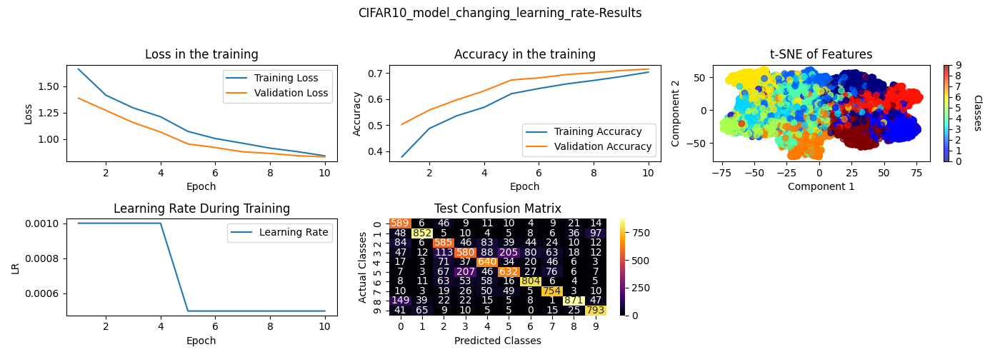
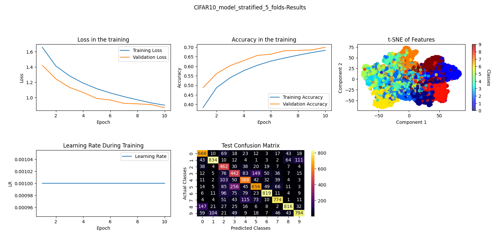
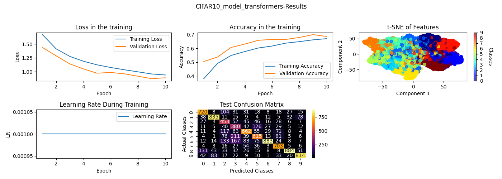

## Model2-Side-Task1-Learninig-Rate-Change
\
By reducing the learning rate, we observe better validation and test accuracy. \
This happens because, as the training progresses, the model's weights are updated more conservatively, which helps prevent overshooting the optimal weights. \
Smaller learning rates allow the model to fine-tune its weights more precisely, reducing the chances of overfitting. \
This gradual adjustment prevents the model from fitting too closely to the training data, leading to better generalization on unseen data (validation and test sets).\
\
Training Results\
\
Epoch 1/10 - Training Loss: 1.6663 - Training Accuracy: 38.29% - Validation Loss: 1.3902 - Validation Accuracy: 49.33%\
Epoch 2/10 - Training Loss: 1.4240 - Training Accuracy: 48.23% - Validation Loss: 1.3059 - Validation Accuracy: 52.49%\
Epoch 3/10 - Training Loss: 1.3060 - Training Accuracy: 52.85% - Validation Loss: 1.1233 - Validation Accuracy: 60.23%\
Epoch 4/10 - Training Loss: 1.2222 - Training Accuracy: 56.48% - Validation Loss: 1.1114 - Validation Accuracy: 60.27%\
Epoch 5/10 - Training Loss: 1.0926 - Training Accuracy: 60.96% - Validation Loss: 0.9854 - Validation Accuracy: 65.41%\
Epoch 6/10 - Training Loss: 1.0353 - Training Accuracy: 63.06% - Validation Loss: 0.9443 - Validation Accuracy: 67.19%\
Epoch 7/10 - Training Loss: 0.9839 - Training Accuracy: 65.01% - Validation Loss: 0.9218 - Validation Accuracy: 68.00%\
Epoch 8/10 - Training Loss: 0.9367 - Training Accuracy: 66.56% - Validation Loss: 0.8971 - Validation Accuracy: 68.33%\
Epoch 9/10 - Training Loss: 0.8953 - Training Accuracy: 67.99% - Validation Loss: 0.8594 - Validation Accuracy: 69.76%\
Epoch 10/10 - Training Loss: 0.8083 - Training Accuracy: 71.23% - Validation Loss: 0.8116 - Validation Accuracy: 71.10%\
\
Test Results\
\
Test Loss: 0.8165 - Test Accuracy: 71.63%\
\

## Model2-Side-Task2-K-Folds
\
CIFAR-10 is known to have an uneven class distribution in certain areas of the dataset. \
To address this, we used a StratifiedKFold approach to ensure that each training and validation split maintains the same class distribution.\
At the end of each fold, we recorded the accuracy and loss for both training and validation at every epoch. \
This allows us to compute the average performance of each epoch across all folds for a more reliable evaluation.\
Below are the results, which indicate that our model generalizes well. The diagram also shows the average performance of each epoch across all folds.\
\
Training Results\
\
Running Set: 0\
\
Epoch 1/10 - Training Loss: 1.6147 - Training Accuracy: 40.47% - Validation Loss: 1.3660 - Validation Accuracy: 50.69%\

Epoch 2/10 - Training Loss: 1.3619 - Training Accuracy: 51.14% - Validation Loss: 1.2349 - Validation Accuracy: 56.15%\

Epoch 3/10 - Training Loss: 1.2305 - Training Accuracy: 56.35% - Validation Loss: 1.0636 - Validation Accuracy: 63.04%\

Epoch 4/10 - Training Loss: 1.1339 - Training Accuracy: 60.11% - Validation Loss: 1.0300 - Validation Accuracy: 64.26%\

Epoch 5/10 - Training Loss: 0.9850 - Training Accuracy: 64.96% - Validation Loss: 0.9081 - Validation Accuracy: 67.76%\

Epoch 6/10 - Training Loss: 0.9172 - Training Accuracy: 67.35% - Validation Loss: 0.8936 - Validation Accuracy: 67.94%\

Epoch 7/10 - Training Loss: 0.8728 - Training Accuracy: 68.71% - Validation Loss: 0.8679 - Validation Accuracy: 69.23%\

Epoch 8/10 - Training Loss: 0.8264 - Training Accuracy: 70.63% - Validation Loss: 0.8433 - Validation Accuracy: 70.14%\

Epoch 9/10 - Training Loss: 0.7879 - Training Accuracy: 71.78% - Validation Loss: 0.8240 - Validation Accuracy: 70.72%\

Epoch 10/10 - Training Loss: 0.7499 - Training Accuracy: 73.35% - Validation Loss: 0.8039 - Validation Accuracy: 71.68%\
\

Running Set: 1\
\
Epoch 1/10 - Training Loss: 1.6330 - Training Accuracy: 39.84% - Validation Loss: 1.3838 - Validation Accuracy: 50.48%\

Epoch 2/10 - Training Loss: 1.3632 - Training Accuracy: 51.07% - Validation Loss: 1.1771 - Validation Accuracy: 58.61%\

Epoch 3/10 - Training Loss: 1.2253 - Training Accuracy: 56.59% - Validation Loss: 1.0357 - Validation Accuracy: 64.01%\

Epoch 4/10 - Training Loss: 1.1250 - Training Accuracy: 60.31% - Validation Loss: 1.0002 - Validation Accuracy: 65.35%\

Epoch 5/10 - Training Loss: 0.9759 - Training Accuracy: 65.34% - Validation Loss: 0.8780 - Validation Accuracy: 69.53%\

Epoch 6/10 - Training Loss: 0.9141 - Training Accuracy: 67.78% - Validation Loss: 0.8426 - Validation Accuracy: 70.13%\

Epoch 7/10 - Training Loss: 0.8692 - Training Accuracy: 69.17% - Validation Loss: 0.8296 - Validation Accuracy: 71.16%\

Epoch 8/10 - Training Loss: 0.8220 - Training Accuracy: 70.94% - Validation Loss: 0.8004 - Validation Accuracy: 72.68%\

Epoch 9/10 - Training Loss: 0.7819 - Training Accuracy: 72.04% - Validation Loss: 0.7888 - Validation Accuracy: 72.57%\

Epoch 10/10 - Training Loss: 0.7373 - Training Accuracy: 73.62% - Validation Loss: 0.7903 - Validation Accuracy: 72.70%\

\
Running Set: 2\

Epoch 1/10 - Training Loss: 1.6387 - Training Accuracy: 39.28% - Validation Loss: 1.4341 - Validation Accuracy: 49.55%\

Epoch 2/10 - Training Loss: 1.4073 - Training Accuracy: 49.36% - Validation Loss: 1.3010 - Validation Accuracy: 54.20%\

Epoch 3/10 - Training Loss: 1.2885 - Training Accuracy: 54.14% - Validation Loss: 1.1389 - Validation Accuracy: 60.60%\

Epoch 4/10 - Training Loss: 1.1941 - Training Accuracy: 57.40% - Validation Loss: 1.0736 - Validation Accuracy: 61.79%\

Epoch 5/10 - Training Loss: 1.0503 - Training Accuracy: 62.42% - Validation Loss: 0.9469 - Validation Accuracy: 66.58%\

Epoch 6/10 - Training Loss: 0.9876 - Training Accuracy: 64.94% - Validation Loss: 0.9128 - Validation Accuracy: 67.90%\

Epoch 7/10 - Training Loss: 0.9384 - Training Accuracy: 66.62% - Validation Loss: 0.8872 - Validation Accuracy: 68.35%\

Epoch 8/10 - Training Loss: 0.8912 - Training Accuracy: 68.15% - Validation Loss: 0.9022 - Validation Accuracy: 68.62%\

Epoch 9/10 - Training Loss: 0.8565 - Training Accuracy: 69.38% - Validation Loss: 0.8498 - Validation Accuracy: 70.42%\

Epoch 10/10 - Training Loss: 0.8184 - Training Accuracy: 70.70% - Validation Loss: 0.8343 - Validation Accuracy: 70.72%\
\

Running Set: 3\

Epoch 1/10 - Training Loss: 1.6521 - Training Accuracy: 38.34% - Validation Loss: 1.3805 - Validation Accuracy: 50.02%\

Epoch 2/10 - Training Loss: 1.3907 - Training Accuracy: 49.29% - Validation Loss: 1.2730 - Validation Accuracy: 54.13%\

Epoch 3/10 - Training Loss: 1.2660 - Training Accuracy: 54.74% - Validation Loss: 1.1257 - Validation Accuracy: 59.90%\

Epoch 4/10 - Training Loss: 1.1683 - Training Accuracy: 58.60% - Validation Loss: 1.0590 - Validation Accuracy: 62.40%\

Epoch 5/10 - Training Loss: 1.0273 - Training Accuracy: 63.69% - Validation Loss: 0.9336 - Validation Accuracy: 67.43%\

Epoch 6/10 - Training Loss: 0.9619 - Training Accuracy: 65.70% - Validation Loss: 0.9161 - Validation Accuracy: 67.99%\

Epoch 7/10 - Training Loss: 0.9102 - Training Accuracy: 67.69% - Validation Loss: 0.8710 - Validation Accuracy: 69.98%\

Epoch 8/10 - Training Loss: 0.8649 - Training Accuracy: 69.31% - Validation Loss: 0.8494 - Validation Accuracy: 70.62%\

Epoch 9/10 - Training Loss: 0.8194 - Training Accuracy: 70.95% - Validation Loss: 0.8576 - Validation Accuracy: 69.95%\

Epoch 10/10 - Training Loss: 0.7744 - Training Accuracy: 72.67% - Validation Loss: 0.8342 - Validation Accuracy: 71.06%\
\

Running Set: 4\

Epoch 1/10 - Training Loss: 1.6349 - Training Accuracy: 39.77% - Validation Loss: 1.4046 - Validation Accuracy: 49.24%\

Epoch 2/10 - Training Loss: 1.3813 - Training Accuracy: 50.01% - Validation Loss: 1.2719 - Validation Accuracy: 55.56%\

Epoch 3/10 - Training Loss: 1.2531 - Training Accuracy: 55.20% - Validation Loss: 1.1004 - Validation Accuracy: 61.97%\

Epoch 4/10 - Training Loss: 1.1558 - Training Accuracy: 59.29% - Validation Loss: 1.0078 - Validation Accuracy: 64.32%\

Epoch 5/10 - Training Loss: 1.0174 - Training Accuracy: 63.96% - Validation Loss: 0.9342 - Validation Accuracy: 67.19%\

Epoch 6/10 - Training Loss: 0.9611 - Training Accuracy: 65.89% - Validation Loss: 0.8859 - Validation Accuracy: 68.78%\

Epoch 7/10 - Training Loss: 0.9176 - Training Accuracy: 67.28% - Validation Loss: 0.8554 - Validation Accuracy: 70.06%\

Epoch 8/10 - Training Loss: 0.8659 - Training Accuracy: 69.23% - Validation Loss: 0.8730 - Validation Accuracy: 69.20%\

Epoch 9/10 - Training Loss: 0.8234 - Training Accuracy: 70.96% - Validation Loss: 0.8311 - Validation Accuracy: 71.72%\

Epoch 10/10 - Training Loss: 0.7885 - Training Accuracy: 71.93% - Validation Loss: 0.8259 - Validation Accuracy: 71.72%\

\
Testing Results\

Test Loss: 0.8346 - Test Accuracy: 71.21%\

## Model2-Side-Task5-Data-Augmentation-Results
\
For the Data Augmentation results, we used the actual mean and standard deviation values of the CIFAR-10 dataset for each channel,\
along with a probability of 0.5 for RandomHorizontalFlip.\
As a result, we achieved an increase of nearly 2 percentage points in validation and test accuracy. This improvement is due to two key factors:\
\
- Using the true dataset statistics for normalization helped the model better fit the actual distribution of the data.\
- Applying RandomHorizontalFlip introduced additional variability, making the model more robust to spatial transformations.\
\
Augmentation Parameters Used:\
\
- RandomHorizontalFlip: 0.5\
- Normalize (Mean): [0.4914, 0.4822, 0.4465]\
- Normalize (Std): [0.2470, 0.2435, 0.2616]\
\
Training Resutls\
\
Epoch 1/10 - Training Loss: 1.6837 - Training Accuracy: 37.49% - Validation Loss: 1.3899 - Validation Accuracy: 50.09%\

Epoch 2/10 - Training Loss: 1.4267 - Training Accuracy: 48.29% - Validation Loss: 1.2606 - Validation Accuracy: 55.60%\

Epoch 3/10 - Training Loss: 1.3081 - Training Accuracy: 53.27% - Validation Loss: 1.1894 - Validation Accuracy: 57.69%\

Epoch 4/10 - Training Loss: 1.2056 - Training Accuracy: 57.36% - Validation Loss: 1.0874 - Validation Accuracy: 63.00%\

Epoch 5/10 - Training Loss: 1.1255 - Training Accuracy: 60.22% - Validation Loss: 1.0124 - Validation Accuracy: 65.06%\

Epoch 6/10 - Training Loss: 1.0685 - Training Accuracy: 62.30% - Validation Loss: 0.9929 - Validation Accuracy: 64.01%\

Epoch 7/10 - Training Loss: 1.0146 - Training Accuracy: 64.22% - Validation Loss: 0.9659 - Validation Accuracy: 66.46%\

Epoch 8/10 - Training Loss: 0.9783 - Training Accuracy: 65.32% - Validation Loss: 0.9210 - Validation Accuracy: 68.16%\

Epoch 9/10 - Training Loss: 0.9415 - Training Accuracy: 66.92% - Validation Loss: 0.8995 - Validation Accuracy: 69.21%\

Epoch 10/10 - Training Loss: 0.9128 - Training Accuracy: 67.74% - Validation Loss: 0.8786 - Validation Accuracy: 69.69%\
\
Test Results\
\
Test Loss: 0.8795 - Test Accuracy: 70.16%\
\

\
We tried also to use RandomCrop transformatioin but unfortunately our model showed signs of underfitting. \
This might stem form the fact that images are too small and as a result they get too much distorted when this kind of transformation is applied.\
\
Augmentation Parameters Used:\
\
- RandomHorizontalFlip: 0.5, \
- Normalize["mean"]:[ 0.4914, 0.4822, 0.4465 ]\
- Normalize["std"]:[ 0.2470, 0.2435, 0.2616 ]\
- RandomCrop:["size": 32,"padding": 4]\
  
Training Results\
\
Epoch 1/10 - Training Loss: 1.8047 - Training Accuracy: 32.74% - Validation Loss: 1.6022 - Validation Accuracy: 41.16%\

Epoch 2/10 - Training Loss: 1.5704 - Training Accuracy: 42.71% - Validation Loss: 1.3196 - Validation Accuracy: 53.04%\

Epoch 3/10 - Training Loss: 1.4480 - Training Accuracy: 47.44% - Validation Loss: 1.3091 - Validation Accuracy: 54.51%\

Epoch 4/10 - Training Loss: 1.3525 - Training Accuracy: 51.51% - Validation Loss: 1.2244 - Validation Accuracy: 57.09%\

Epoch 5/10 - Training Loss: 1.2921 - Training Accuracy: 54.04% - Validation Loss: 1.1363 - Validation Accuracy: 61.17%\

Epoch 6/10 - Training Loss: 1.2394 - Training Accuracy: 55.72% - Validation Loss: 1.1080 - Validation Accuracy: 60.89%\

Epoch 7/10 - Training Loss: 1.1913 - Training Accuracy: 57.74% - Validation Loss: 1.0649 - Validation Accuracy: 63.18%\

Epoch 8/10 - Training Loss: 1.1612 - Training Accuracy: 58.64% - Validation Loss: 1.0160 - Validation Accuracy: 65.37%\

Epoch 9/10 - Training Loss: 1.1211 - Training Accuracy: 60.34% - Validation Loss: 1.0086 - Validation Accuracy: 64.88%\

Epoch 10/10 - Training Loss: 1.1006 - Training Accuracy: 61.00% - Validation Loss: 1.0004 - Validation Accuracy: 65.33%\
\
Test Results\
\
Test Loss: 0.9987 - Test Accuracy: 65.60%\
\
## Model 2-Side-Task6-t-SNE-Analysis\
\
List of Classes and Indexes:\
\
Airplane (Index 0),Automobile (Index 1),Bird (Index 2),Cat (Index 3),Deer (Index 4),\
Dog (Index 5),Frog (Index 6),Horse (Index 7),Ship (Index 8),Truck (Index 9)\
\
In the t-SNE map, we observe that:\
\
1. Vehicles (Automobile, Truck, Airplane, Ship) tend to be grouped together on the right side of the graph, while the Animals (Bird, Cat, Dog, Frog, Deer, Horse) are found on the left.\
\
2. Automobile (Index 1) and Truck (Index 9) are the nearest to each other, with some overlap. This is likely due to shared features like wheels, rectangular shapes, and similar sizes.\
\
3. Automobile (Index 1) also overlaps with Airplane (Index 0), possibly because of the presence of wheels in both classes, and even some overlap with animal classes, likely due to the general shape.\
\
4. Airplane (Index 0) and Ship (Index 8) show overlap as well. This could be due to their similar sizes and oval or rectangular shapes.\
\
5. In the Animal category, there is a noticeable overlap between Cat (Index 3), Bird (Index 2), and Dog (Index 5). The similarities in size, shape, and body structure (e.g., legs) likely contribute to this confusion.\
\
6. Deer (Index 4) and Horse (Index 7) appear more distinct from Cat and Dog, potentially because they are larger animals with different head-nose structures, although some overlap still exists.\
\
7. Frog (Index 6) stands out as a class with the least common traits compared to the other animals. This likely results in it being well-separated from the other classes.\
\

