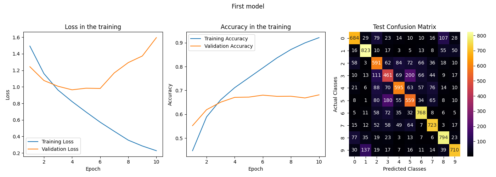

Using device: cuda:0 \
Training set: 40000 immagini \
Validation set: 10000 immagini \
Test set: 10000 immagini \
Input : 32 , 3 @ 32 x 32 \
------ Convolution 1 ------ \
convolution 1 kernel : 5 \
P :  0 \
S :  1 \
Output : 32 , 32 @ 28 x 28 \
------ Pooling 1 ------ \
pooling 1 kernel : 2 \
S :  2 \
Output : 32 , 32 @ 14 x 14 \
------ Convolution 2 ------ \
convolution 2 kernel : 5 \
P :  0 \
S :  1 \
Output : 32 , 64 @ 10 x 10 \
------ Pooling 2 ------ \
pooling 2 kernel : 2 \
S :  2 \
Output : 32 , 64 @ 5 x 5 \
------ Fully Connected Layers ------ \
Input :  32 , 1600 \
------ Layer 1 ------ \
output :  32 , 2040 \
------ Layer 2 ------ \
output :  32 , 1024 \
------ Output ------ \
output :  32 , 10 \

Model Architecture: \
========================================================================================== \
Layer (type:depth-idx)                   Output Shape              Param # \
========================================================================================== \
Sequential                               [32, 10]                  --      \
├─Conv2d: 1-1                            [32, 32, 28, 28]          2,432   \
├─ReLU: 1-2                              [32, 32, 28, 28]          --      \
├─MaxPool2d: 1-3                         [32, 32, 14, 14]          --      \
├─Conv2d: 1-4                            [32, 64, 10, 10]          51,264  \
├─ReLU: 1-5                              [32, 64, 10, 10]          --      \
├─MaxPool2d: 1-6                         [32, 64, 5, 5]            --      \
├─Flatten: 1-7                           [32, 1600]                --      \
├─Linear: 1-8                            [32, 2040]                3,266,040 \
├─ReLU: 1-9                              [32, 2040]                --      \
├─Linear: 1-10                           [32, 1024]                2,089,984 \
├─ReLU: 1-11                             [32, 1024]                --      \
├─Linear: 1-12                           [32, 10]                  10,250  \
========================================================================================== \
Total params: 5,419,970 \
Trainable params: 5,419,970 \
Non-trainable params: 0 \
Total mult-adds (Units.MEGABYTES): 396.78 \
========================================================================================== \
Input size (MB): 0.39 \
Forward/backward pass size (MB): 8.85 \
Params size (MB): 21.68 \
Estimated Total Size (MB): 30.92 \
========================================================================================== \

Beginning of training... \
Epoch 1/10 - Training Loss: 1.4937 - Training Accuracy: 44.74% - Validation Loss: 1.2439 - Validation Accuracy: 55.24% \
Epoch 2/10 - Training Loss: 1.1606 - Training Accuracy: 58.92% - Validation Loss: 1.0769 - Validation Accuracy: 61.93% \
Epoch 3/10 - Training Loss: 0.9619 - Training Accuracy: 66.06% - Validation Loss: 1.0074 - Validation Accuracy: 65.07% \
Epoch 4/10 - Training Loss: 0.8225 - Training Accuracy: 71.17% - Validation Loss: 0.9644 - Validation Accuracy: 67.10% \
Epoch 5/10 - Training Loss: 0.6956 - Training Accuracy: 75.30% - Validation Loss: 0.9837 - Validation Accuracy: 67.20% \
Epoch 6/10 - Training Loss: 0.5728 - Training Accuracy: 79.44% - Validation Loss: 0.9804 - Validation Accuracy: 68.03% \
Epoch 7/10 - Training Loss: 0.4629 - Training Accuracy: 83.61% - Validation Loss: 1.1683 - Validation Accuracy: 67.53% \
Epoch 8/10 - Training Loss: 0.3554 - Training Accuracy: 87.16% - Validation Loss: 1.2935 - Validation Accuracy: 67.57% \
Epoch 9/10 - Training Loss: 0.2849 - Training Accuracy: 89.93% - Validation Loss: 1.3735 - Validation Accuracy: 66.85% \
Epoch 10/10 - Training Loss: 0.2276 - Training Accuracy: 92.13% - Validation Loss: 1.5955 - Validation Accuracy: 68.15% \

Training completed! \

Testing started! \
Test Loss: 1.6120 - Test Accuracy: 67.08% \

Testing completed! \

