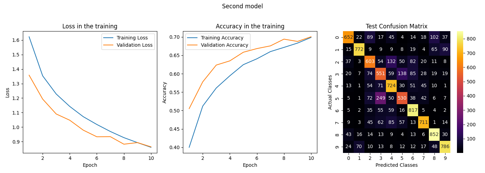

Using device: cuda:0 \
Training set: 40000 immagini \
Validation set: 10000 immagini \
Test set: 10000 immagini \
Input : 32 , 3 @ 32 x 32 \
------ Convolution 1 ------ \
convolution 1 kernel : 5 \
P :  0 \
S :  1 \
Output : 32 , 32 @ 28 x 28 \
------ Pooling 1 ------ \
pooling 1 kernel : 2 \
S :  2 \
Output : 32 , 32 @ 14 x 14 \
------ Convolution 2 ------ \
convolution 2 kernel : 5 \
P :  0 \
S :  1 \
Output : 32 , 64 @ 10 x 10 \
------ Pooling 2 ------ \
pooling 2 kernel : 2 \
S :  2 \
Output : 32 , 64 @ 5 x 5 \
------ Fully Connected Layers ------ \
Input :  32 , 1600 \
------ Layer 1 ------ \
output :  32 , 2040 \
------ Layer 2 ------ \
output :  32 , 1024 \
------ Output ------ \
output :  32 , 10 \

Model Architecture: \
========================================================================================== \
Layer (type:depth-idx)                   Output Shape              Param # \
========================================================================================== \
Sequential                               [32, 10]                  --      \
├─Conv2d: 1-1                            [32, 32, 28, 28]          2,432   \
├─ReLU: 1-2                              [32, 32, 28, 28]          --      \
├─MaxPool2d: 1-3                         [32, 32, 14, 14]          --      \
├─Dropout: 1-4                           [32, 32, 14, 14]          --      \
├─Conv2d: 1-5                            [32, 64, 10, 10]          51,264  \
├─ReLU: 1-6                              [32, 64, 10, 10]          --      \
├─MaxPool2d: 1-7                         [32, 64, 5, 5]            --      \
├─Dropout: 1-8                           [32, 64, 5, 5]            --      \
├─Flatten: 1-9                           [32, 1600]                --      \
├─Linear: 1-10                           [32, 2040]                3,266,040 \
├─ReLU: 1-11                             [32, 2040]                --      \
├─Linear: 1-12                           [32, 1024]                2,089,984 \
├─ReLU: 1-13                             [32, 1024]                --      \
├─Linear: 1-14                           [32, 10]                  10,250  \
========================================================================================== \
Total params: 5,419,970 \
Trainable params: 5,419,970 \
Non-trainable params: 0 \
Total mult-adds (Units.MEGABYTES): 396.78 \
========================================================================================== \
Input size (MB): 0.39 \
Forward/backward pass size (MB): 8.85 \
Params size (MB): 21.68 \
Estimated Total Size (MB): 30.92 \
========================================================================================== \

Beginning of training... \
Epoch 1/10 - Training Loss: 1.6230 - Training Accuracy: 39.99% - Validation Loss: 1.3580 - Validation Accuracy: 50.52% \
Epoch 2/10 - Training Loss: 1.3537 - Training Accuracy: 51.19% - Validation Loss: 1.1932 - Validation Accuracy: 57.78% \
Epoch 3/10 - Training Loss: 1.2282 - Training Accuracy: 56.12% - Validation Loss: 1.0903 - Validation Accuracy: 62.35% \
Epoch 4/10 - Training Loss: 1.1424 - Training Accuracy: 59.43% - Validation Loss: 1.0472 - Validation Accuracy: 63.49% \
Epoch 5/10 - Training Loss: 1.0715 - Training Accuracy: 62.46% - Validation Loss: 0.9786 - Validation Accuracy: 65.84% \
Epoch 6/10 - Training Loss: 1.0179 - Training Accuracy: 64.05% - Validation Loss: 0.9329 - Validation Accuracy: 66.83% \
Epoch 7/10 - Training Loss: 0.9694 - Training Accuracy: 66.02% - Validation Loss: 0.9336 - Validation Accuracy: 67.57% \
Epoch 8/10 - Training Loss: 0.9270 - Training Accuracy: 67.15% - Validation Loss: 0.8817 - Validation Accuracy: 69.40% \
Epoch 9/10 - Training Loss: 0.8926 - Training Accuracy: 68.33% - Validation Loss: 0.8928 - Validation Accuracy: 68.78% \
Epoch 10/10 - Training Loss: 0.8602 - Training Accuracy: 69.86% - Validation Loss: 0.8635 - Validation Accuracy: 70.04% \

Training completed! \

Testing started! \
Test Loss: 0.8682 - Test Accuracy: 69.98% \

Testing completed! \

